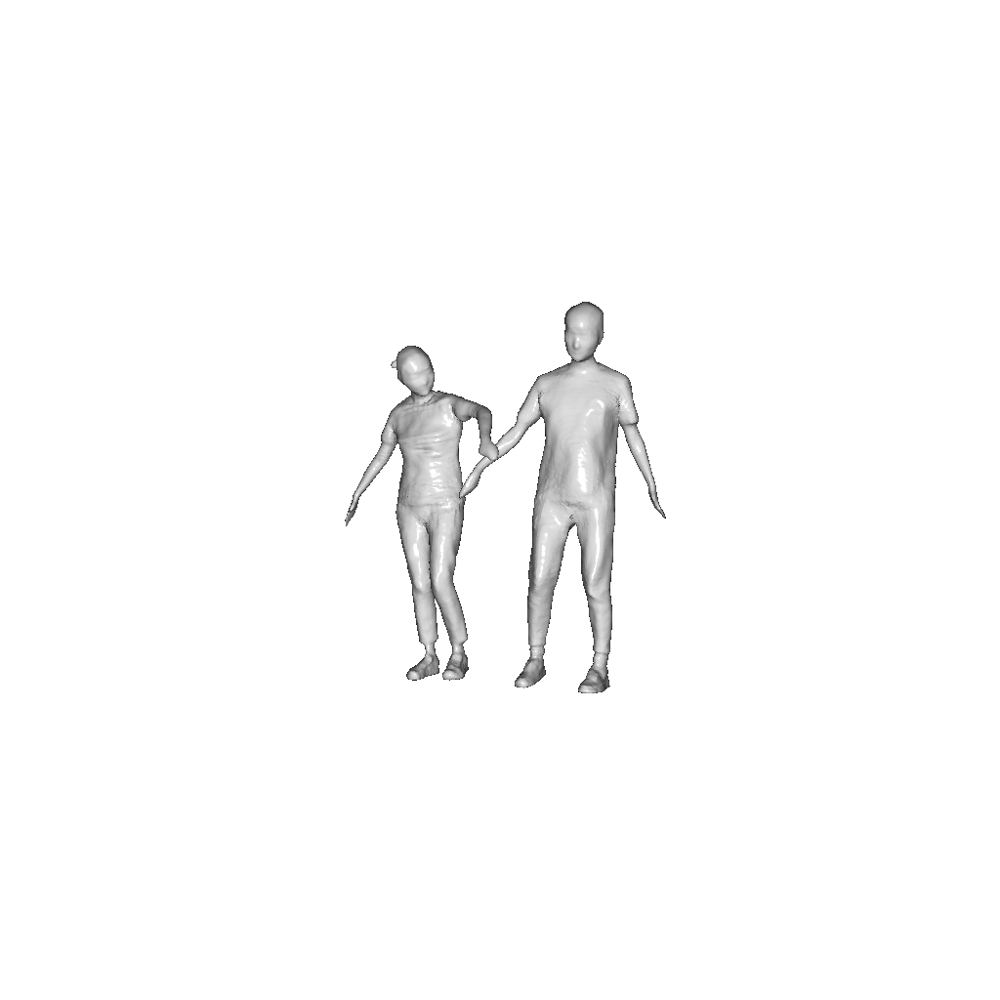
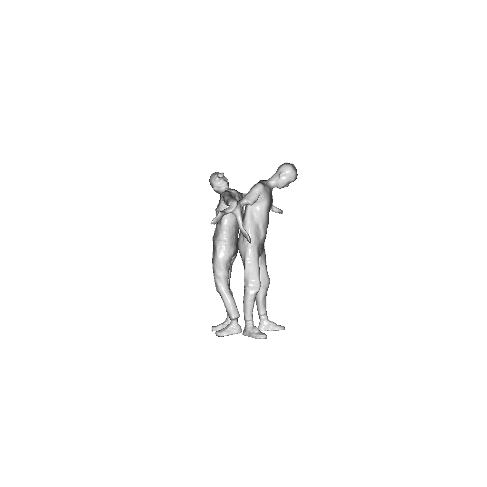
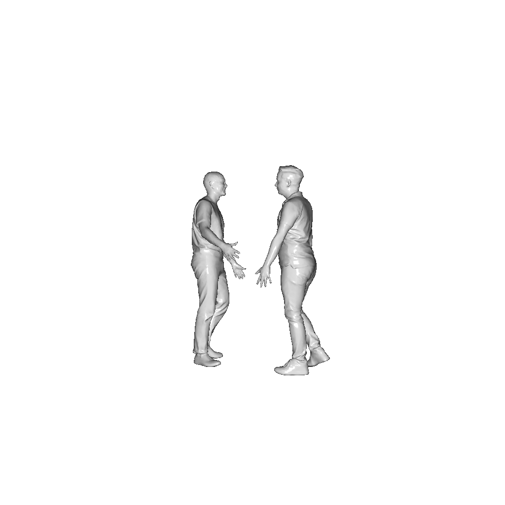
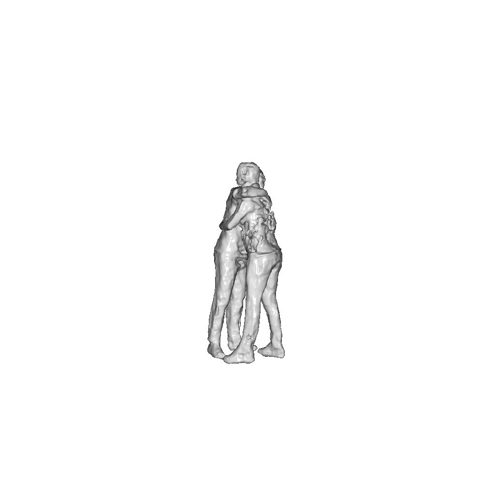
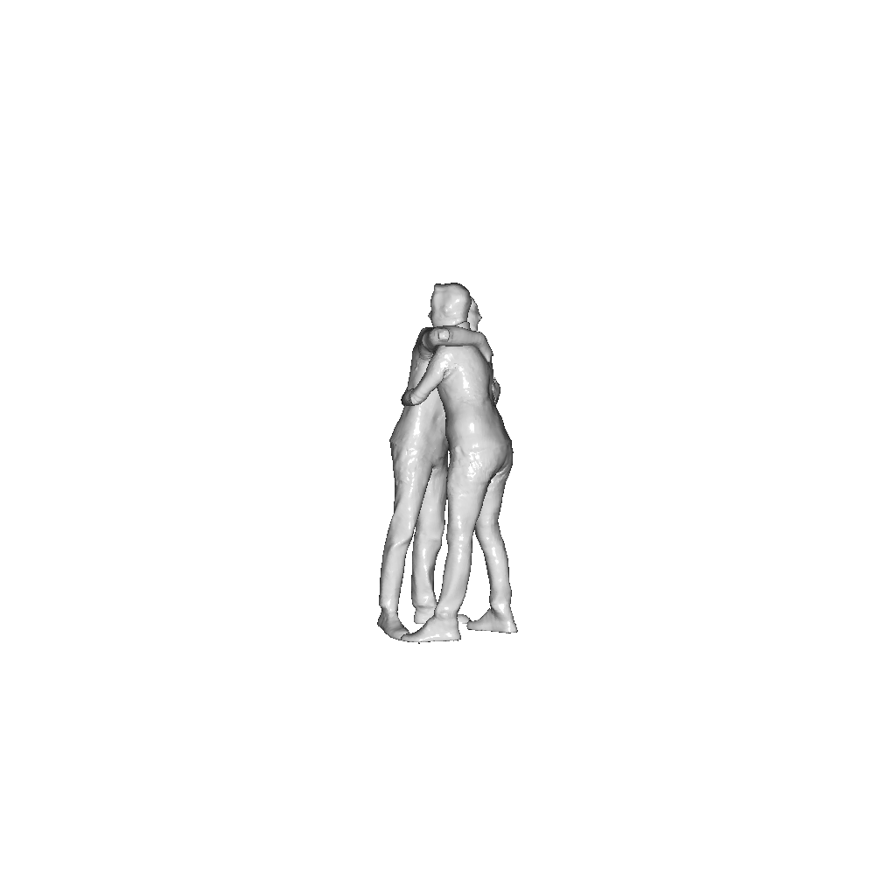
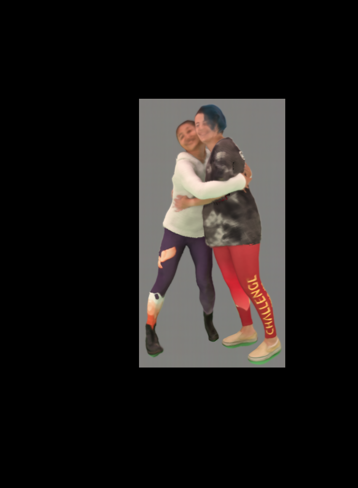
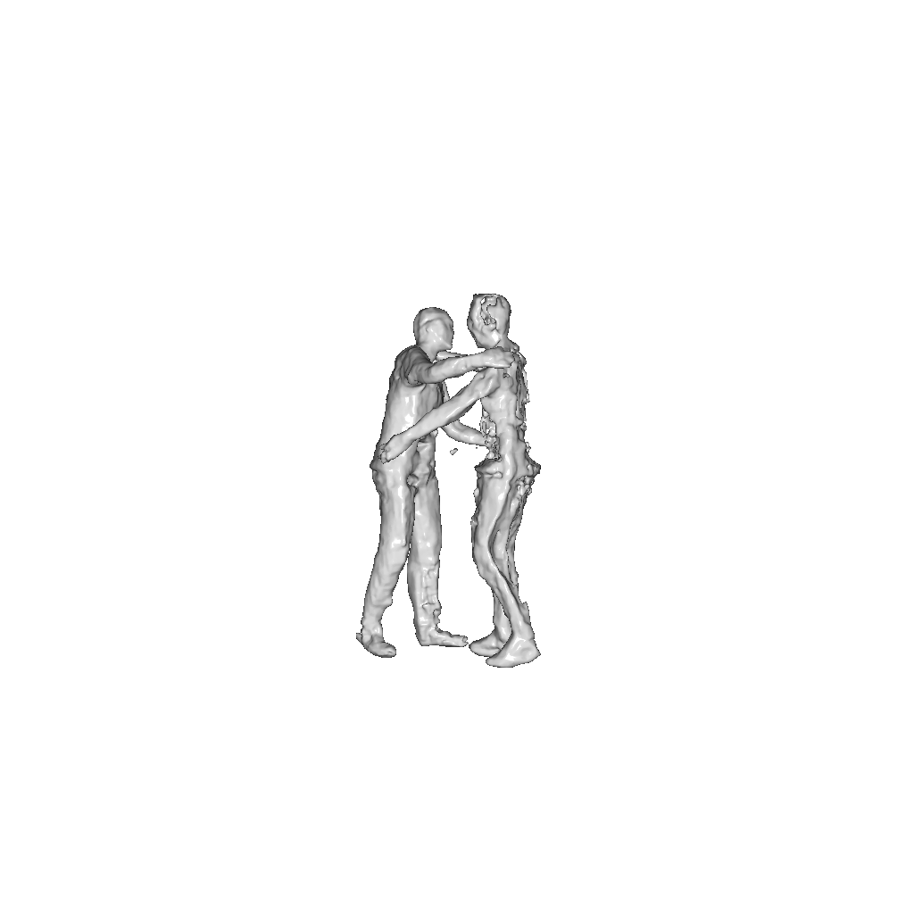

# MV2MP: Segmentation Free Performance Capture of Humans in Direct Physical Contact from Sparse Multi-Cam Setups

## Resulting meshes comparison

### Hi4d "Sidehug"

| Frame | DMC | MultiNeuralBody | Ours | GT |
|------------|--------|--------|--------|--------|
| 10 |  |   | ||
| 40 |  |   | ||
| 80 |  |   | ||

### Hi4d "Yoga"

| Frame | DMC | MultiNeuralBody | Ours | GT |
|------------|--------|--------|--------|--------|
| 10 |  |   | ||
| 40 |  |   | ||
| 80 |  |   | ||

### Hi4d "Hug"

| Frame | DMC | MultiNeuralBody | Ours | GT |
|------------|--------|--------|--------|--------|
| 11 |  |   | ||
| 41 |  |   | ||
| 81 |  |   | ||

### CMU panoptic "Haggling"

| Frame | DMC | MultiNeuralBody | Ours |
|------------|--------|--------|--------|
| 9000 |  |   | |
| 9030 |  |   | |
| 9090 |  |   | |

## Resulting renders comparison

### Hi4d "Sidehug"

| Frame | MultiNeuralBody | Ours | GT |
|------------|--------|--------|--------|
| 10 |  |   | |
| 40 |  |   | |
| 80 |  |   | |

### Hi4d "Yoga"

| Frame | MultiNeuralBody | Ours | GT |
|------------|--------|--------|--------|
| 10 |  |   | |
| 40 |  |   | |
| 80 |  |   | |

### Hi4d "Hug"

| Frame | MultiNeuralBody | Ours | GT |
|------------|--------|--------|--------|
| 11 |  |   | |
| 41 |  |   | |
| 81 |  |   | |

### CMU panoptic "Haggling"

| Frame | MultiNeuralBody | Ours | GT |
|------------|--------|--------|--------|
| 9000 |  |   | |
| 9030 |  |   | |
| 9090 |  |   | |

## Cameras sparcity investigation. 

### Hi4d  "Yoga" frame 40
| Cameras | DMC  |  MultiNeuralBody | Ours| GT |
|------------|--------|--------|--------|--------|
|7 |  |          |                   ||
|5 | |  | | |
|3 | | diverged |                                                                           | |

### Hi4d  "Sidehug" frame 40
| Cameras | DMC  |  MultiNeuralBody | Ours| GT |
|------------|--------|--------|--------|--------|
|7 |  |          |                   ||
|5 | |  |   | |
|3 | | diverged |                                                                           | |

### Hi4d  "Hug" frame 51
| Cameras | DMC  |  MultiNeuralBody | Ours| GT |
|------------|--------|--------|--------|--------|
|7 |  |          |                   ||
|5 | |  | | |
|3 | | diverged |                                                                           | |

